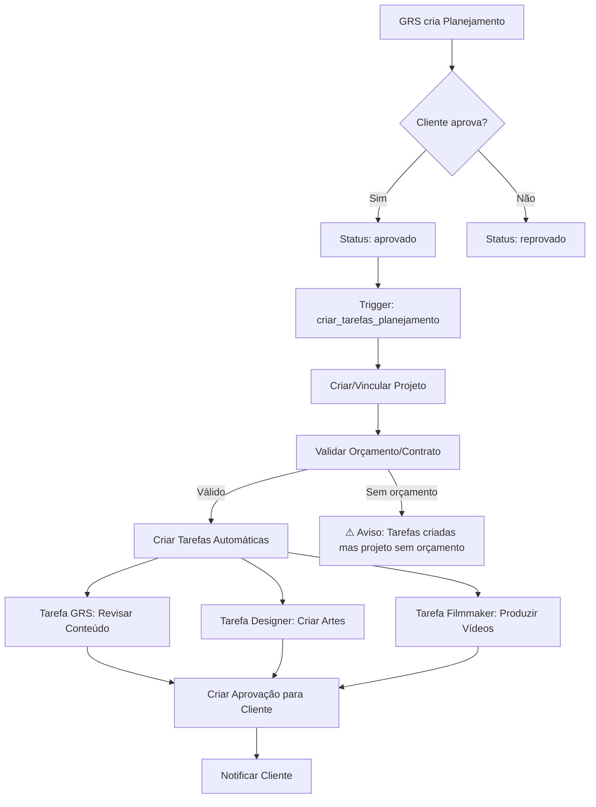
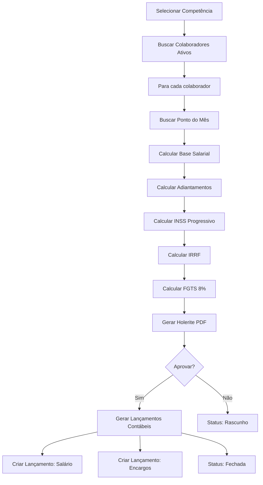
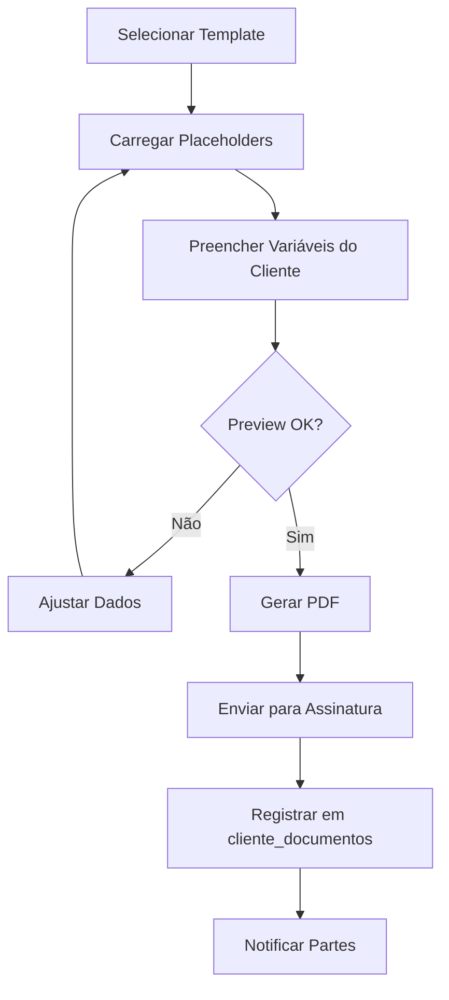
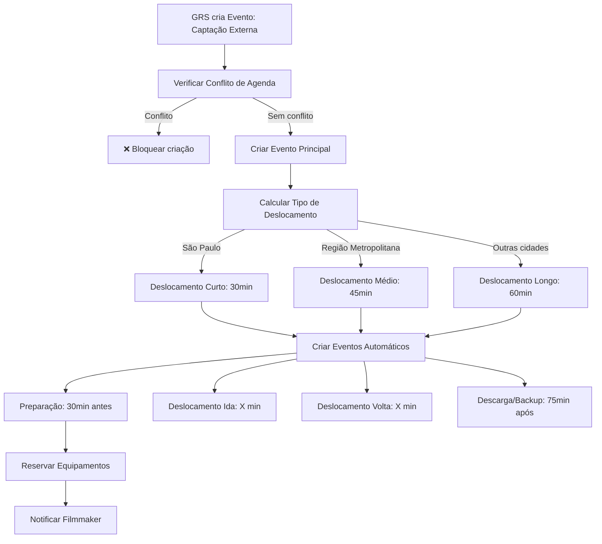
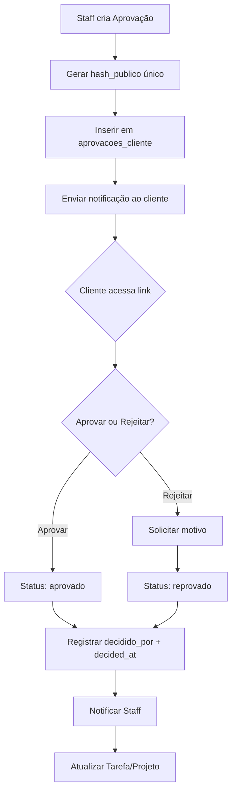
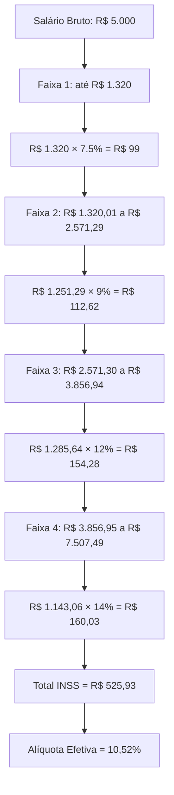

# 📚 Processos Críticos do Sistema

Este documento descreve os principais fluxos de negócio do sistema, com diagramas e regras de validação.

## 🎯 1. Aprovação de Planejamento Editorial



### Regras de Negócio:
- ✅ Planejamento só pode ser aprovado por Cliente ou Admin
- ✅ Ao aprovar, cria automaticamente:
  - Projeto (se não existir) com mês de referência
  - Tarefa para GRS (revisar conteúdo) - prazo: 5 dias
  - Tarefa para Designer (criar artes) - prazo: 10 dias
  - Tarefa para Filmmaker (produzir vídeos) - prazo: 15 dias (se houver posts de vídeo)
- ✅ Vincula especialistas ao projeto via `projeto_especialistas`
- ⚠️ Valida se projeto tem orçamento/contrato aprovado
- 🔔 Gera notificação para cliente via `aprovacoes_cliente`

### Trace ID:
Todas as operações compartilham o mesmo `trace_id` para rastreabilidade.

---

## 💼 2. Fechamento de Folha de Pagamento



### Regras de Negócio:
- ✅ Só pode fechar folha uma vez por mês/colaborador
- ✅ Adiantamentos são automaticamente descontados
- ✅ INSS: Cálculo progressivo conforme `financeiro_faixas_inss`
- ✅ IRRF: Aplicado sobre (Salário - INSS - Dependentes)
- ✅ FGTS: 8% sobre salário bruto (não deduz do colaborador)
- ✅ Ao fechar, cria lançamentos contábeis:
  - Débito: Despesa com Pessoal (2.1.01.001)
  - Crédito: Salários a Pagar (2.1.01.002)

### Tabelas Envolvidas:
- `financeiro_folha` (cabeçalho)
- `financeiro_folha_itens` (detalhamento por colaborador)
- `rh_folha_ponto` (horas trabalhadas, extras, faltas)
- `financeiro_adiantamentos` (descontos)
- `financeiro_lancamentos` (contabilização)

---

## 📝 3. Geração de Contrato



### Variáveis Disponíveis:
- `{{nome_empresa}}` - Nome fantasia do cliente
- `{{razao_social}}` - Razão social (CNPJ)
- `{{cnpj}}` - CNPJ formatado
- `{{endereco}}` - Endereço completo
- `{{responsavel_nome}}` - Nome do responsável (GRS)
- `{{data_assinatura}}` - Data de assinatura
- `{{valor_mensal}}` - Valor do plano
- `{{frequencia_posts}}` - Frequência de postagens
- `{{servicos}}` - Lista de serviços contratados

### Regras de Negócio:
- ✅ Template deve validar todas as `{{chaves}}` obrigatórias
- ✅ Preview em tempo real ao digitar
- ✅ PDF gerado via edge function (server-side)
- ⚠️ Versionamento automático (incrementa `versao` a cada alteração)

---

## 🎬 4. Agendamento de Captação Externa



### Regras de Negócio:
- ✅ Apenas GRS pode agendar captações
- ✅ Sistema cria automaticamente 4 eventos bloqueantes:
  1. Preparação/Checklist (30min antes)
  2. Deslocamento Ida (antes da captação)
  3. **Captação** (evento principal)
  4. Deslocamento Volta (após captação)
  5. Descarga/Backup (75min após volta)
- ✅ Todos os eventos são `is_bloqueante = true`
- ✅ Equipamentos são reservados via `fn_criar_reserva_equipamento()`
- ⚠️ Se equipamento já estiver reservado → bloqueia agendamento

### Duração de Deslocamento:
| Tipo | Duração | Trigger |
|------|---------|---------|
| Curto | 30min | Local contém "São Paulo" ou "SP" |
| Médio | 45min | Local preenchido (sem SP) |
| Longo | 60min | Local vazio ou outras cidades |

---

## 🔒 5. Sistema de Aprovações de Cliente



### Regras de Negócio:
- ✅ Hash público é gerado via `encode(gen_random_bytes(16), 'hex')`
- ✅ Link de aprovação: `/aprovacao/{hash_publico}`
- ✅ Cliente não precisa estar logado (acesso via hash)
- ✅ Uma vez decidido (aprovado/reprovado), não pode alterar
- 🔔 Trigger `registrar_decisao_aprovacao` notifica automaticamente

### Tipos de Aprovação:
- `planejamento` - Aprovação de planejamento editorial
- `arte` - Aprovação de peça gráfica
- `video` - Aprovação de vídeo/reel
- `roteiro` - Aprovação de roteiro/copy
- `outro` - Aprovações genéricas

---

## 📊 6. Cálculo de INSS Progressivo



### Implementação:
```sql
SELECT * FROM fn_calcular_inss(5000.00, '2024-01-01');
-- Retorna: valor_inss, aliquota_efetiva, faixas_aplicadas (JSON)
```

### Regras de Negócio:
- ✅ Faixas configuráveis em `financeiro_faixas_inss`
- ✅ Vigência controlada por `vigencia_inicio` e `vigencia_fim`
- ✅ Teto máximo respeita `teto_inss` em `financeiro_parametros_fiscais`
- ⚠️ Função retorna JSONB com detalhamento de cada faixa

---

## ⚙️ 7. Performance e Otimizações

### Índices Criados:
```sql
-- Financeiro
idx_financeiro_lancamentos_data_tipo (data_lancamento DESC, tipo_origem)
idx_rh_folha_ponto_colaborador_competencia (colaborador_id, competencia DESC)

-- Tarefas
idx_tarefa_executor_status (executor_id, status) WHERE executor_id IS NOT NULL
idx_tarefa_responsavel_prazo (responsavel_id, prazo_executor DESC)

-- Eventos
idx_eventos_calendario_responsavel_data (responsavel_id, data_inicio DESC)
```

### Cache Strategy (React Query):
| Tipo de Dado | staleTime | gcTime | Exemplo |
|--------------|-----------|--------|---------|
| Estático | 1 hora | 24 horas | Plano de Contas |
| Semi-estático | 10 min | 1 hora | Clientes |
| Dinâmico | 1 min | 5 min | Tarefas |
| Crítico | 30s | 2 min | Lançamentos Financeiros |
| Tempo Real | 0s | 1 min | Dashboard Métricas |

---

## 🚨 Pontos de Atenção

### Segurança:
- ✅ Todas as tabelas sensíveis têm RLS habilitado
- ✅ Funções SECURITY DEFINER para evitar recursão de RLS
- ⚠️ Credenciais de cliente em `credenciais_cliente` - acesso restrito Admin/Gestor/GRS

### Validações Críticas:
- ✅ Adiantamento não pode exceder salário bruto
- ✅ Reserva de equipamento valida disponibilidade
- ✅ Planejamento valida orçamento antes de criar tarefas
- ✅ Folha de ponto valida competência única

### Logs e Auditoria:
- ✅ `log_atividade_tarefa` registra todas as ações em tarefas
- ✅ `audit_logs` registra alterações em posts
- ✅ `audit_sensitive_access` registra acessos a dados sensíveis
- ✅ `assinatura_logs` registra eventos de assinatura Gov.br

---

## 📞 Suporte

Em caso de dúvidas sobre processos críticos, consulte:
- `/admin/painel` - Health Check do sistema
- `/grs/homologacao` - Checklist de validação
- Logs estruturados via `logger.ts`
